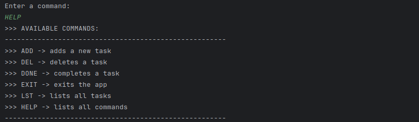

# 🗂️ Task Manager (Console Application)



A simple **console-based Task Manager** built in Java.  
It allows adding, listing, completing, and deleting tasks, with automatic file-based persistence.

---

## ✨ Features

- **ADD** `<description>` – Add a new task (incomplete by default)
- **LST** – List all tasks
- **DONE** `<id>` – Mark a task as completed
- **DEL** `<id>` – Delete a task
- **HELP** – Show all available commands
- **EXIT** – Exit the application

---

## 🗃️ Storage Format

Tasks are stored in the file **`tasks.dat`** in a simple text-based format:

[ ] id: 1 - Buy milk  
[X] id: 2 - Study sockets  


- `[ ]` → incomplete
- `[X]` → completed

Task IDs are unique and persisted separately in **`id.dat`**, ensuring consistency between sessions.

---

## ⚙️ How to Run

1. **Clone the repository:**
   ```bash
   git clone https://github.com/Kvilarinho/taskmanager.git
   cd taskmanager


2. Build with Maven:  
   mvn clean package  

3. Run the application:  
   java -jar target/taskmanager-1.0.0.jar  

## Example session

Enter a command:
ADD Buy milk
OK id: 1

ADD Study sockets
OK id: 2

LST
[ ] id: 1 - Buy milk
[ ] id: 2 - Study sockets

DONE 1
OK

LST
[X] id: 1 - Buy milk
[ ] id: 2 - Study sockets

DEL 2
OK

EXIT
Bye

## Technical notes

- Implements the Strategy Pattern using a Map<Command, Function> for command execution.  
- Tasks are persisted automatically to tasks.dat after every change.  
- IDs are managed via id.dat, ensuring unique and stable identifiers. 
- Includes basic error handling for invalid commands and missing tasks.
- Follows modular design with clear separation of concerns between commands, I/O, and persistence.

## Future Improvements (v2)

- Replace List<String> with a dedicated Task model class
- Use LinkedHashMap<Integer, Task> for better ID management and ordering
- Introduce TaskRepository and TaskService for cleaner architecture
- Add unit tests for main functionalities
- Transition to an MVC-based web version

## Requirements

- Java 17+  
- Maven 3.8+  
---

**© 2025 – Kátia Vilarinho**  
*Version 1.0 – CLI Edition*
